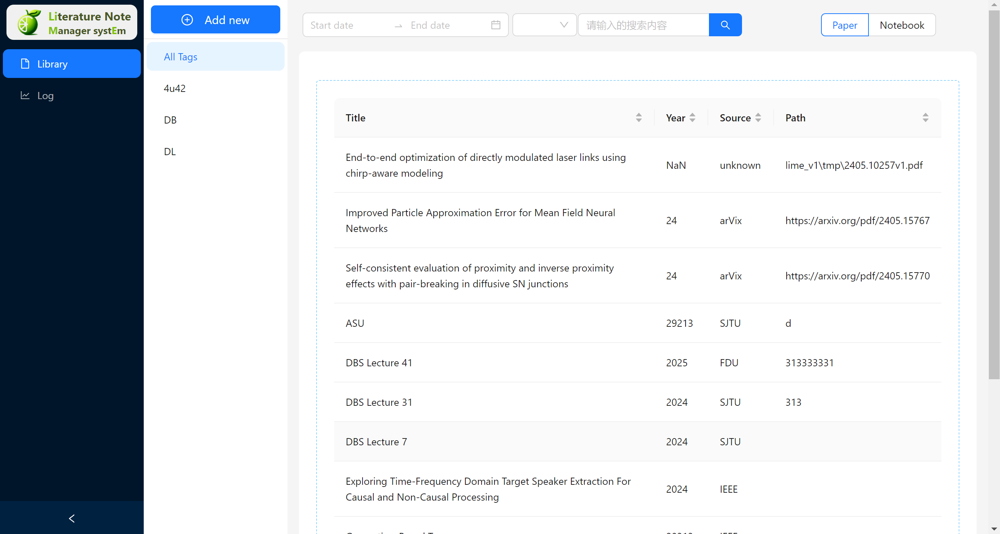
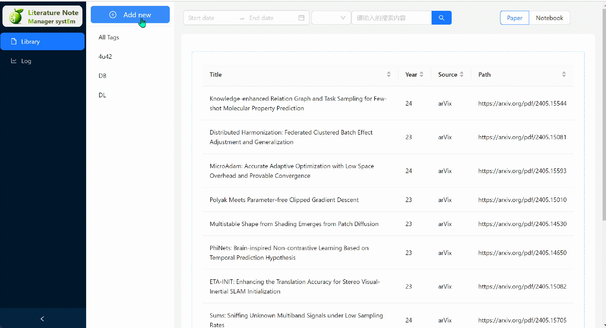
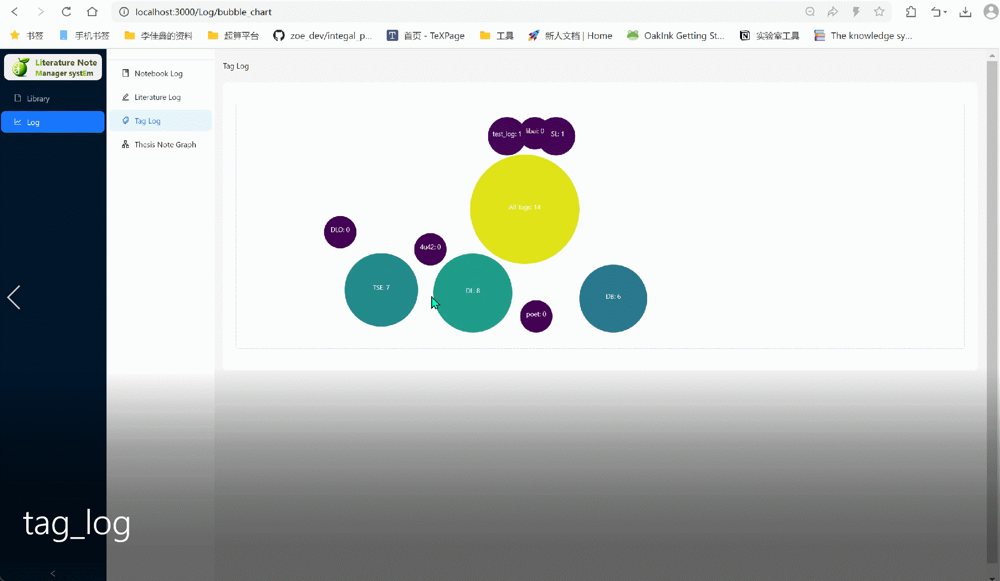
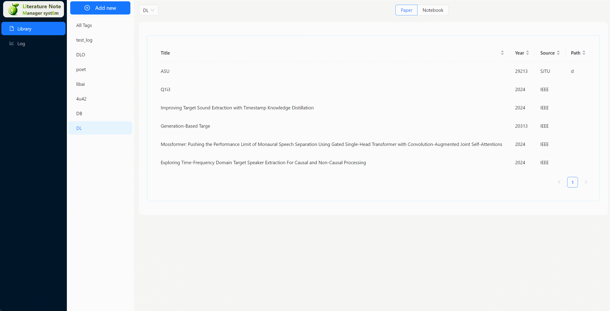

<div align="center">
    <h1>
    🍋Lime 
    </h1>
    <p>
        <b>LIME</b> is a <b>Li</b>terature Note <b>M</b>anager syst<b>E</b>m  based on neo4j dataset that allows researchers and students to manager their literatures and notebook in local and visualize the relation between different notebooks and literatures.Using this manager, the user find the location of literature and notebooks in their computer no longer troubled by too many and messy literature
        . <br>
    </p>
    <p>
    
    </p>
    <p>
    </p>
<a href="https://github.com/Jerrister/CS3321_v2"></a>  <a href="https://github.com/Jerrister/CS3321_v2"></a>   <a href="https://github.com/ddlBoJack/SLAM-LLM"></a> 
</div>


## Start 

#### get the system github repo

`git clone https://github.com/Jerrister/CS3321_v2.git`


#### config and start the neo4j datset

- download and open Neo4j Desktop
- create the project， Name: ` limelime` ,  Password: `limelime`
- add files: `neo4j.dump` into Neo4j Desktop
- import `neo4j.dump` into project `limelime`  , rename `mylime`


#### set the configuration in lime

- check the file `lime_v1\src\services\neo4jService.js`

  ```
  const URI = 'bolt://localhost:7687';
  const USER = 'limelime';
  const PASSWORD = 'limelime'; // in the beiginning of code
  ```

  ```
  const session = driver.session({ database: 'mylime' });  // in the line 22
  ```


#### start the system

- open a terminal , run: 

  ```
  cd .\lime_v1
  npm start
  ```

- open another terminal , run: 

  ```
  python .\lime_v1\src\python_utils\PythonService.py
  ```


#### LLM assistant 

- we use the LLM API from Tongyi Qianwen

-  Get the key follow  [authentic doc](https://help.aliyun.com/zh/dashscope/developer-reference/activate-dashscope-and-create-an-api-key?spm=a2c4g.11186623.0.0.fd243116VM86QL )

- set the configuration in `lime_v1\src\python_utils\LLM.py`

  ```
  dashscope.api_key=" × × × × × ×"
  ```

  


## frontend

- ⚡**Sleek**     
- 👆 **Highly Interactive**
- 😊 **User-Friendly**


<div align="center">
<h3> The index page </h3>
<p>

</p>
</div>


## Function

- :notebook_with_decorative_cover: literature table ;  tag tree ;  paper literature column;  page 

  :mag:  sort  ; domain search ; interval search

  <div align="center">
      <video width="600" controls>
          <source src="img/result_pre.mp4" type="video/mp4">
          Your browser does not support the video tag.
      </video>
      </div>

  ​    


- :file_folder: multi-way importer

  | Import from arxiv                  | Import from file folder            | Import manually                     |
  | ---------------------------------- | ---------------------------------- | ----------------------------------- |
  |  |  |  |


- :chart: delete \ edit 

  <div style="display: flex; justify-content: space-around; text-align: center;">
      <div style="margin: 10px;">
          <p>Paper delete and edit</p>
          <video width="400" controls>
              <source src="img/edit_delete.mp4" type="video/mp4">
              Your browser does not support the video tag.
          </video>
      </div>
      <div style="margin: 10px;">
          <p>Delete Tag and edit</p>
          <video width="400" controls>
              <source src="img/delete_tag.mp4" type="video/mp4">
              Your browser does not support the video tag.
          </video>
      </div>
  </div>


- :radio: visualization

<div style="display: flex; justify-content: space-around; text-align: center;">     <div style="margin: 10px;">         <p>📜 Log Tracking</p>              </div>     <div style="margin: 10px;">         <p>🏷️ Tag Count</p>         <video width="400" controls>             <source src="img/log_track.mp4" type="video/mp4">             Your browser does not support the video tag.         </video>     </div> </div>


- 🔗 Connection Web

<div style="display: flex; justify-content: space-around; text-align: center;">
        <div>
                <p> :label: Graph</p>
               <video width="400" controls>
                <source src="img/graph.mp4" type="video/mp4">
                Your browser does not support the video tag.
            </video>
        </div>
</div>


- :robot:   LLM analyzer

<div align="center">
<p>

</p>
</div>


