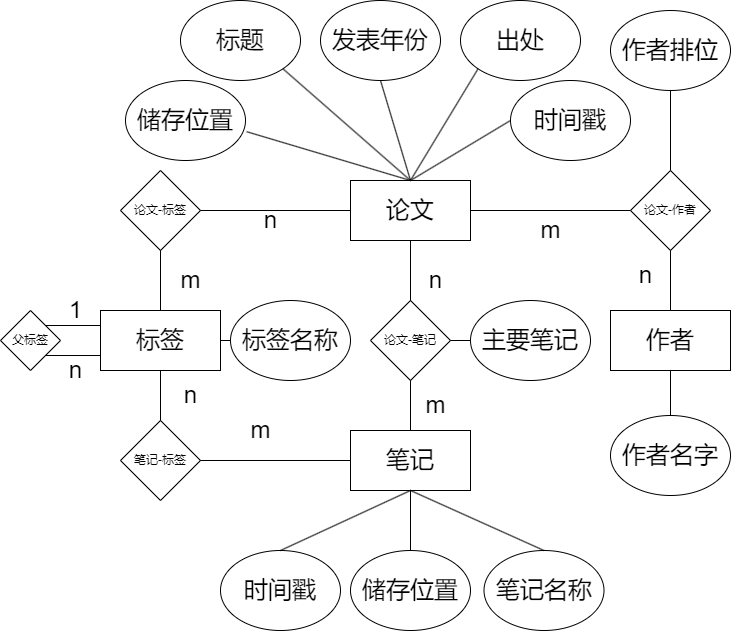

# 需求分析：

1. 基础需求分析

试想这样一个情形：用户在进行科研工作时，需要阅读大量的论文，随着时间的推移，用户所积累的论文数量逐渐增多，假设有一天，用户需要找到他之前度过的一篇文章，用户打开他放论文的文件夹，如果用户没有精心打理这个文件夹，他会看到很多文件名称各异的PDF文件，此时，找到用户印象中的那篇文章变得相当困难！

用户在进行科研工作时，常常需要查阅大量的文献资料。这些文献不仅来源广泛，包括各类学术期刊、会议论文集和预印本服务器等，而且格式主要为PDF文件。面对繁多的文献资源，用户在管理和查找特定论文时常常感到力不从心。特别是当用户需要针对某一特定主题或关键词进行深入研究时，快速、精准地定位相关论文显得尤为重要。

其次，传统的文件夹管理方式在处理大量PDF文件时存在诸多不足。例如，文件命名不统一、存放位置分散、缺乏有效的标签和注释功能等问题，均可能导致用户在需要查找某篇特定论文时费时费力。此外，用户可能还希望能够在同一平台上完成论文的阅读、注释、标记和分类等操作，以此来提高科研效率。除了论文之外，用户可能还希望对论文留下自己的阅读笔记，来记录当时自己的一些想法。

因此，我们设计的数据库旨在为用户提供一个高效的论文与笔记管理和检索平台，具体包括以下功能：

(1) 自动数据提取与分类：用户向系统提交新的PDF文件后，我们的数据库能够自动提取论文的标题、作者、关键词等元数据，实现论文的自动分类。用户还可以自定义标签，以便个性化管理。

(2) 多维度检索：用户能够通过作者、关键词、标签、文章标题等多种方式检索数据库，从而快速找到所需文献。

(3) 图形化操作界面：我们提供了直观的图形化操作界面，使用户能够更轻松地浏览和管理文章。

(4) 数据记录与分析：系统能够记录各篇文章的录入时间和标签的总数，并对这些数据进行分析，为用户提供有价值的参考信息。

2. 数据流图

我们为用户需求绘制了数据流图并制作了数据字典。图如下：

从顶层数据流程图可以看出，我们的数据流模型相对比较简单，就是唯一的用户和数据库进行交互。

这是第一层数据流程图，我们将"接受事务"进行了细分。由于用户修改或是查询的数据可能都包含多个数据结构，为了方便，我们将论文、笔记、作者、标签都当作一整个"数据库内容"来处理。如图，我们将原有的处理事务划分为了"增加删除修改数据库内容"和"检索数据库内容"两部分，数据流从用户发出最后流回用户。虽然该数据流程图表现地较简单，实际上我们为用户添加了对数据的多维查询、操作和可视化显示，并没有在上述数据流图种表现出来。

3. 数据字典

按照以上的想法，我们设计了数据字典，数据字典如下。

3.1 数据项

> 数据项： 名称
说明： 论文或笔记或标签或作者的名称
类型： 字符型

> 数据项： 年份
说明： 论文发表的时间
类型： 整数型
取值范围：0000至9999

> 数据项： 出处
说明： 论文的发表地
类型： 字符型

> 数据项： 储存位置
说明： 论文或笔记的储存路径
类型： 字符型

> 数据项： 时间戳
说明： 记录加入的时间
类型： 字符型

> 数据项： 作者位次
类型： 整数型

> 数据项： 笔记名称
类型： 字符型

3.2  数据结构

> 数据结构：论文
组成： 名称，年份，储存位置，时间戳，出处

> 数据结构：笔记
组成： 名称，储存位置，时间戳

> 数据结构：作者
组成： 名称

> 数据结构：标签
组成： 名称

3.3 数据流

> 数据流： 修改数据库
说明： 用户对数据库内容进行增添、删除、修改
数据流来源：用户修改数据库
数据流去向：修改结果
组成：论文，笔记，作者，标签
平均流量：很低
高峰期流量：中等

> 数据流： 检索数据库
说明： 用户对数据库内容进行增添、删除、修改
数据流来源：用户检索数据库
数据流去向：检索结果
组成：论文，笔记，作者，标签
平均流量：一天几百次
高峰期流量：一小时内几百次

3.4 数据储存

> 数据存储： 实体及关系信息
说明： 记录论文、笔记、标签、作者的信息及它们之间的关系
输入数据流：修改数据库，检索数据库
输出数据流：修改数据库，检索数据库
组成： 论文，笔记，作者，标签
数据量： 每年几百篇
存取方式： 随机存取

3.5 处理过程

> 处理过程：修改数据库
说明： 用户对数据库内容进行增添、删除、修改
输入： 论文，笔记，作者，标签
输出： 修改是否成功
处理： 在接收到用户对论文，笔记，作者，标签的增添、删除、修改需求后，执行相应的操作

> 处理过程：检索数据库
说明： 用户对数据库内容进行检索
输入： 字符型
输出： 论文，笔记，作者，标签
处理： 按照用户给定的字符型进行检索，返回相关的论文，笔记，作者，标签的列表或是可视化。

# 概念分析&逻辑分析

在需求分析种，我们已经数据结构和数据项，现在我们需要将数据结构建立为实体，并赋予关系，RE图如下所示：

然后，我们将其转化为关系模式，关系模式如下：

>论文 (**标题**, 储存位置, 发表年份, 出处, 时间戳)
笔记(**笔记名称**, 储存位置, 时间戳)
作者(**作者名字**)
标签(**标签名称**)
论文-笔记(**标题**, **笔记名称**，是否主要笔记)
论文-标题(**标题**, **作者名字**, 作者排位)
论文-标签(**标题**, **笔记名称**)
笔记-标签(**笔记名称**, **tag**)

# 数据库物理分析

考虑到我们需要为用户提供图形化论文关系展示界面，我们直接使用图数据库 Neo4j 作为我们的基础。

Neo4j 是一个高性能的图数据库管理系统，用于存储和管理高度互联的数据。与传统的关系型数据库不同，Neo4j 使用图理论的数据模型，能够高效地处理节点和关系，从而在处理复杂的连接和关系查询方面表现出色。此外，图数据结构直观地映射为图形，使得数据关系更容易理解和操作，并且它不需要预定义模式，能够灵活地处理不断变化的数据模型。

Neo4j 本质上就是储存一个异构图，在这个图中，每个实体都是一个节点，彼此通过关系作为边相连接。

在上述关系模式中，我们可以发现所有关系都是多对多关系。如果按照第三范式设计传统关系型数据库，在进行查询时，会产生大量的表格拼接操作，费时费力，而Neo4J则可以通过其图结构能够快速地进行复杂的关系查询，性能相较关系型数据库有很大的提升。

